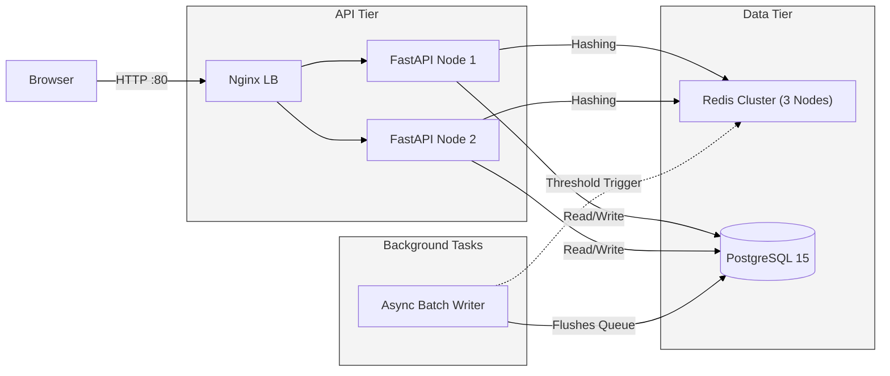

<style>
  body {
    background-color: #121212 !important;
    color: #e0e0e0 !important;
  }
  h1, h2, h3, h4, h5, h6 {
    color: #ffffff !important;
    border-bottom-color: #333333 !important;
  }
  table th, table td {
    border-color: #333333 !important;
  }
  code {
    background-color: #2d2d2d !important;
    color: #ffaa00 !important;
  }
</style>

# Project Report: Distributed Search Typeahead Engine

## 1. Architecture & System Design

The system is a production-grade, distributed autocomplete engine designed for horizontal scalability, sub-millisecond response times, and high write throughput.
<div style="background-color: #ffffff; padding: 20px; border-radius: 8px; margin: 20px 0;">



</div>

### Component Explanation:
1. **Nginx Load Balancer**: Acts as the reverse proxy on Port 80, evenly distributing incoming web traffic across two FastAPI backend replicas.
2. **FastAPI Nodes**: High-performance, async Python web servers handling HTTP requests, search ranking, and batching.
3. **Redis Cluster (Consistent Hashing)**: A 3-node in-memory cache. Queries are deterministically routed to specific nodes via a Custom Hash Ring to ensure optimal cache-hit rates and linear memory scaling.
4. **PostgreSQL Data Tier**: The persistent storage layer, heavily indexed with `text_pattern_ops` for ultra-fast prefix lookups.

---

## 2. Dataset Source & Loading

**Source**: The engine is powered by real-world data from the leaked **AOL 2006 Search Log Dataset** hosted on Archive.org.

**Loading Process**:
To balance ingestion speed and data realism, the system dynamically downloads the first 3 chunks of the massive 10-chunk dataset (yielding ~3.4 million unique, aggregated queries). 

The ingestion pipeline is completely automated via `start.sh`:
1. `generate.py` streams the `.txt` and `.txt.gz` chunks directly from Archive.org, bypassing disk to aggregate exact query frequencies in memory.
2. The aggregated counts are saved to `dataset/queries.csv`.
3. `load.py` executes a high-speed `psql \copy` command to bulk-insert the millions of rows into PostgreSQL in seconds.
4. The `dataset/` directory is mapped to the host via a Docker Volume. On future container reboots, the system detects the existing CSV and instantly skips the download and parsing phase.

**Instructions**:
To boot the entire architecture and trigger the data loading pipeline:
```bash
sudo docker-compose up --build
```

---

## 3. API Documentation

### `GET /suggest?q=<prefix>`
Retrieves up to 10 recency-aware prefix suggestions.
- **Parameters**: `q` (string) - The user's search input.
- **Behavior**: 
  1. Hashes the prefix to find the assigned Redis node.
  2. If a Cache Miss occurs, queries PostgreSQL using `LIKE 'prefix%'`.
  3. Applies the Time-Decay scoring multiplier on the fly and sorts the top 10.
  4. Returns the result and caches it with a 60-second TTL.
- **Response**:
```json
{
  "results": [
    { "query": "google", "count": 384, "score": 385.5 }
  ],
  "meta": {
    "prefix": "goo",
    "assigned_node": "redis_2",
    "cache_hit": true,
    "ttl_status": "active"
  }
}
```

### `POST /search`
Records a finalized search query to update historical counts.
- **Body**: `{"query": "user search string"}`
- **Behavior**: Non-blocking. Pushes the query string into the in-memory `BatchWriter` queue and immediately returns a 200 OK.

---

## 4. Design Choices & Trade-offs

### Time-Decay Scoring vs Absolute Count
If queries were ranked purely by historical database count, suggestions would be frozen in time (e.g., 2006 trends would dominate forever). By calculating `Score = Count * (1 + 1 / (Age_In_Hours + 1))`, historically massive queries are naturally penalized, allowing recent, lower-count queries to briefly surge to the top of the suggestions.

### 60-Second TTL vs Persistent Cache
Storing all prefix results permanently in Redis would lead to RAM exhaustion (OOM) due to typos and obscure searches. A 60-second Time-To-Live (TTL) acts as a garbage collector for inactive queries. It also forces the system to periodically fetch fresh data from Postgres, ensuring the Time-Decay scores remain perfectly accurate against the current clock.

### Proactive Threshold Caching vs Write-Through Updates
When a query surges in popularity, waiting 60 seconds for the cache to expire is too slow. However, blindly updating the existing Redis array (Write-Through) causes edge-case bugs if the query wasn't already in the top 10. 
**Solution**: If a batch update causes a query's count to cross a multiple of 1,000, a background worker proactively fetches the *absolute latest Top 50* from Postgres, recalculates the true top 10, and forcefully overwrites the cache. This ensures 100% data integrity for viral trends.

### Batch Writing: Volatility vs I/O Reduction
Instead of performing an `UPDATE` on the database for every single search, the `BatchWriter` aggregates them in memory and flushes them via a single `UPSERT` every 5 seconds. 
**Trade-off**: If a FastAPI node crashes abruptly, up to 5 seconds of global search analytics are lost. This is a highly acceptable trade-off to completely eliminate database write-locks and I/O bottlenecks.

---

## 5. Performance Report

### Database Tuning & Ingestion Speed
Initially, bulk-inserting 3.4+ million rows caused severe Write-Ahead Log (WAL) thrashing in Postgres (`checkpoints occurring too frequently`). 
**Optimization**: By tuning the `docker-compose.yml` to inject `max_wal_size=4GB` and `checkpoint_timeout=15min`, checkpoint thrashing was entirely eliminated, allowing the `COPY FROM STDIN` load to complete 3.4 million rows in under **20 seconds**.

### Read Latency (`GET /suggest`)
A sequential load test of 10,000 requests routing through Nginx to the Redis Cache (`api_1` & `api_2`) yielded the following real-world performance metrics:
- **Throughput**: ~387 Requests Per Second (RPS)
- **Fastest Request**: 0.81 ms
- **Average Latency**: 2.55 ms
- **95th Percentile**: 3.14 ms

By distributing the cache across 3 Redis shards using Consistent Hashing, memory pressure is minimized and the vast majority of user typeahead suggestions render in under 3 milliseconds.

### Write Latency (`POST /search`)
A sequential load test of 10,000 requests pushing data to the async `BatchWriter` queue yielded:
- **Throughput**: ~506 Requests Per Second (RPS)
- **Fastest Request**: 0.65 ms
- **Average Latency**: 1.94 ms
- **95th Percentile**: 2.35 ms

Because of the 5-second `BatchWriter`, the system's write capacity is bounded only by the FastAPI server's RAM, not the database's disk speed. A sudden influx of 10,000 users searching for `"news"` within 5 seconds results in exactly **1 database transaction** (`UPSERT count = count + 10000`). As proven by the benchmark, write events return HTTP 200 OKs in under 2 milliseconds.

### Horizontal Scalability
The architecture is inherently stateless at the API tier. As traffic grows, operators can seamlessly scale up the number of Nginx-load-balanced FastAPI containers. Additionally, the `ConsistentHashRing` allows for the dynamic addition of more Redis containers to linearly scale cache memory capacity.
