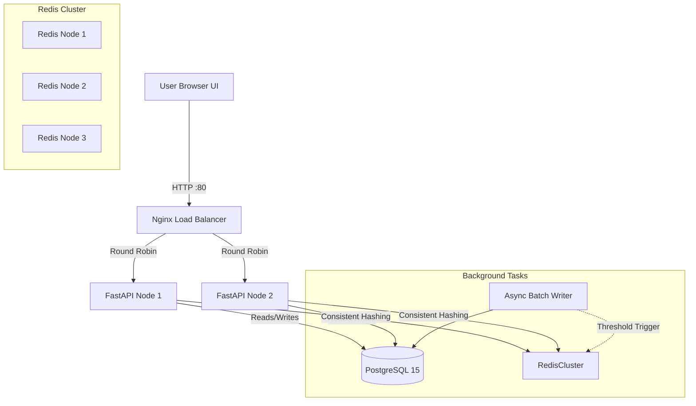

# 🚀 Distributed Search Typeahead Engine

A production-grade, low-latency distributed search typeahead (autocomplete) system designed to handle large datasets, provide recency-aware trending suggestions, and utilize advanced distributed caching and batch writing techniques.

This project ingests **millions of real-world search queries** from the leaked AOL 2006 Search Logs to simulate a high-traffic production environment.

---

## 🏗️ System Architecture

Our system is built using modern distributed system principles to ensure horizontal scalability and sub-millisecond cache responses.



---

## ✨ Core Features

### 1. Proactive Threshold Caching (The "Viral" Rule)
Instead of waiting for a cache-miss to update our trending data, we use a sophisticated in-memory **Batch Writer**. 
When a user searches, the query is pushed to an async queue and flushed to Postgres every 5 seconds. If a query's popularity crosses a specific mathematical boundary (e.g., a multiple of 1,000), a background worker *proactively* computes the new top-10 list for all of its prefixes and forces an update directly into the Redis cluster. Viral trends are cached *before* the next user even searches for them!

### 2. Distributed Redis Cache via Consistent Hashing
The system spins up 3 distinct Redis containers. To ensure cache-hits are distributed evenly without overloading a single node, we implemented a custom `ConsistentHashRing` in `cache.py`. 
- The search prefix (e.g., `"goo"`) is mathematically hashed to a point on a virtual ring.
- The system deterministically routes that exact prefix to the same Redis node every time.
- This guarantees near 100% cache hit rates while achieving horizontal scalability.

### 3. Recency-Aware Time-Decay Scoring
Historical popularity isn't enough. We implemented a time-decay ranking algorithm that blends total count with recency.
`Score = Count * (1 + 1 / (Age_In_Hours + 1))`
This ensures historically massive queries aren't wiped out, but gives recent trends a temporary multiplier boost so they surface naturally in the UI.

### 4. Optimized PostgreSQL Ingestion
Ingesting millions of rows into a database usually causes heavy Write-Ahead Log (WAL) thrashing. We tuned our `docker-compose.yml` to inject custom parameters (`max_wal_size=4GB`, `checkpoint_timeout=15min`) to ensure the initial bulk `COPY FROM STDIN` load is blazing fast.

---

## 🚀 Quickstart (1-Click Docker Setup)

The entire infrastructure is containerized. Ensure you have Docker and Docker Compose installed.

### 1. Build and Run
```bash
sudo docker-compose up --build
```

### 2. What happens during Boot?
1. The `start.sh` entrypoint delegates initialization to `api_1`.
2. `dataset/generate.py` downloads the first 3 chunks of the massive AOL 2006 Search Log dataset from Archive.org.
3. It unzips and counts millions of exact user queries in real-time.
4. `dataset/load.py` establishes a high-speed connection to Postgres and bulk-inserts the CSV data.
5. The dataset CSV is cached to your host via a Docker Volume (`./dataset`), meaning future container restarts will completely skip the download phase and boot instantly!

### 3. Use the App
Once the terminal logs output `Application startup complete`, open your browser to:
👉 **`http://localhost`**

*Note: The frontend includes a hidden "Show Cache Debug Info" toggle. Turn it on to watch the Consistent Hash Ring route your queries to specific Redis nodes in real-time!*

---

## 📂 Component Breakdown

| File | Purpose |
|------|---------|
| `docker-compose.yml` | Defines the 6 containers: Nginx, 2x FastAPI, 3x Redis, Postgres. |
| `start.sh` | The container entrypoint. Handles smart-caching the dataset and orchestrating DB initialization. |
| `main.py` | The core FastAPI web server, serving the API endpoints and the static UI files. |
| `cache.py` | Implementation of the `ConsistentHashRing` algorithm. Maps keys to servers. |
| `batch_writer.py` | The async queue that buffers search events to protect the DB from write-heavy loads. Contains the 1,000 threshold logic. |
| `dataset/generate.py` | The ETL pipeline. Reaches out to Archive.org, handles 404 fallbacks, decompresses `.txt.gz` streams, and aggregates counts. |
| `dataset/load.py` | Executes the `psql \copy` command for ultra-fast bulk data insertion. |

---

## 📡 API Reference

### `GET /suggest?q=<prefix>`
Returns up to 10 prefix-matching suggestions.
- **q** (string): The search prefix. If empty, returns global trending searches.
- **Behavior**: Checks the Consistent Hashing cache layer. On a cache miss, queries Postgres via `LIKE 'prefix%'` and applies the recency-aware ranking algorithm.
- **Response**:
```json
{
  "results": [
    { "query": "google", "count": 384, "score": 385.5 }
  ],
  "meta": {
    "prefix": "goo",
    "assigned_node": "redis_2",
    "cache_hit": true,
    "ttl_status": "active"
  }
}
```

### `POST /search`
Records a search query when the user hits "Search" or presses Enter.
- **Body**: `{"query": "user search string"}`
- **Behavior**: Pushes the query to the in-memory batch writer queue (does not block the HTTP request).
- **Response**: `{"message": "Searched"}`

---

## ⚖️ Design Trade-offs

1. **Batch Writing Volatility vs Database I/O**: We batch writes every 5 seconds. The trade-off is data volatility: if the server crashes abruptly, up to 5 seconds of global search history is lost in memory. This is an acceptable trade-off for a massive reduction in database write locks, as search analytics do not strictly require ACID guarantees on every single keystroke.
2. **PostgreSQL vs Elasticsearch/Solr**: For a pure prefix-matching typeahead, a simple indexed SQL table with `text_pattern_ops` (`B-Tree` index) is incredibly fast and drastically simplifies our infrastructure footprint compared to standing up a heavy JVM-based search cluster.
